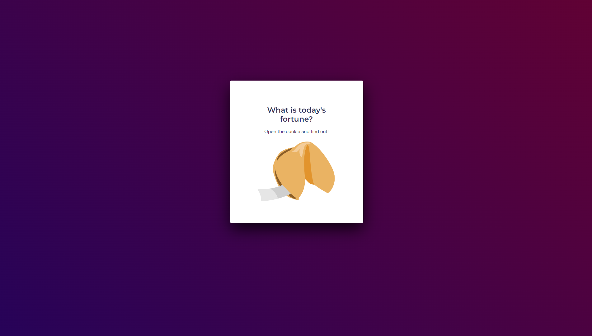
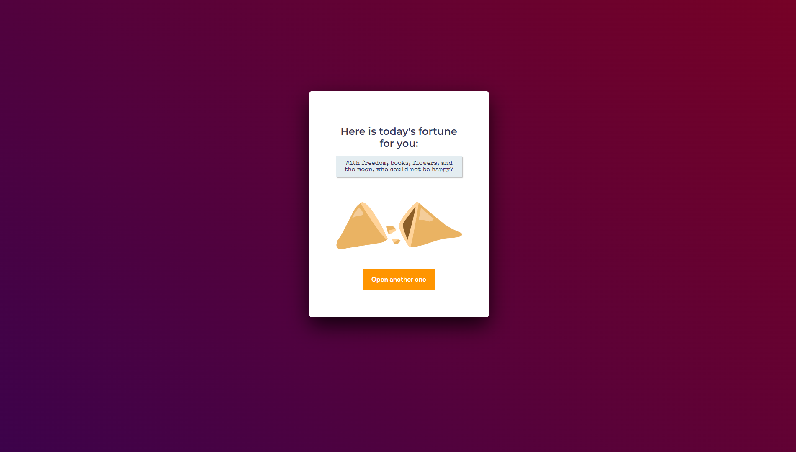

# Fortune Cookie

## What is this?

This is an application that genarates a random fortune cookie message, done as a challenge during the fifth module of the **Rocketseat Explorer** course.

____

## Preview

___

## Technologies used in this project

  

